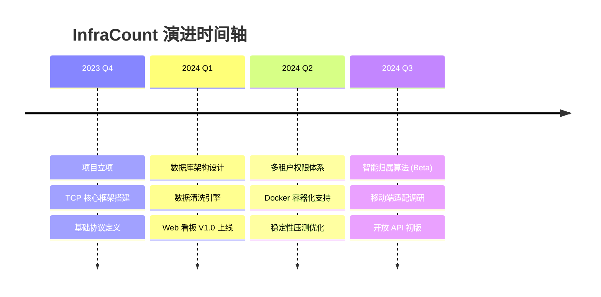
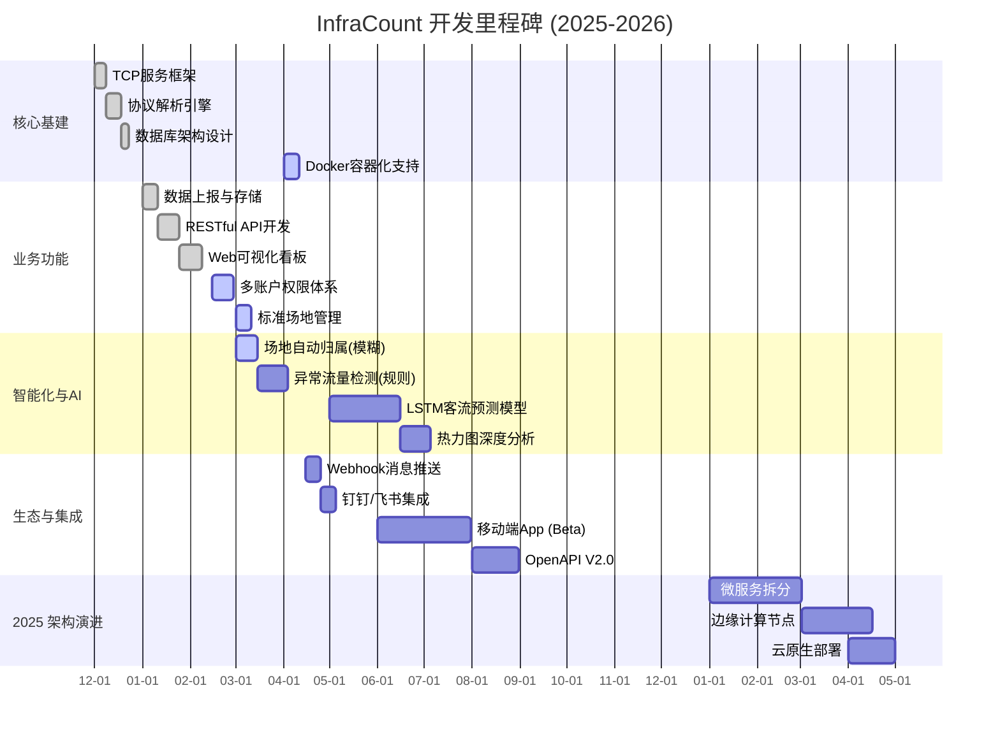
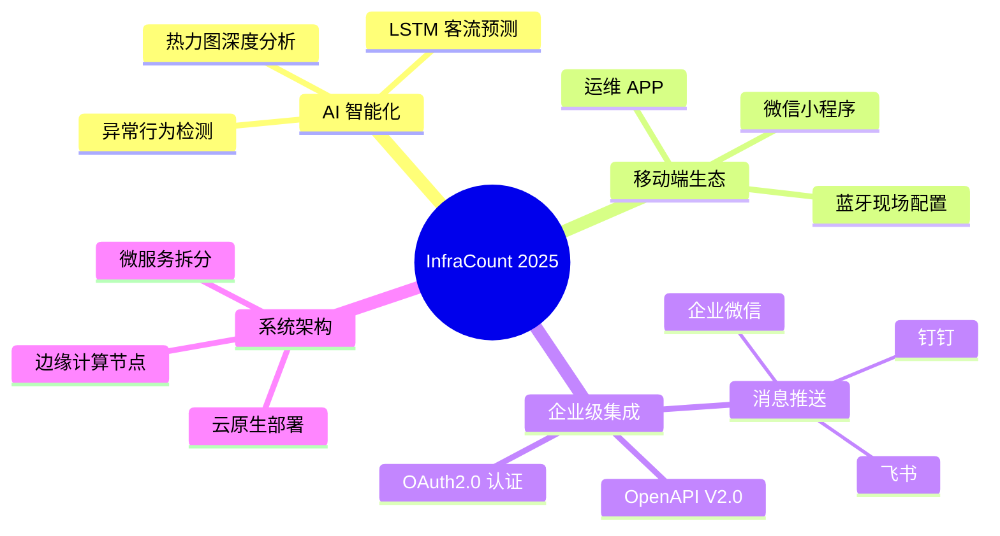
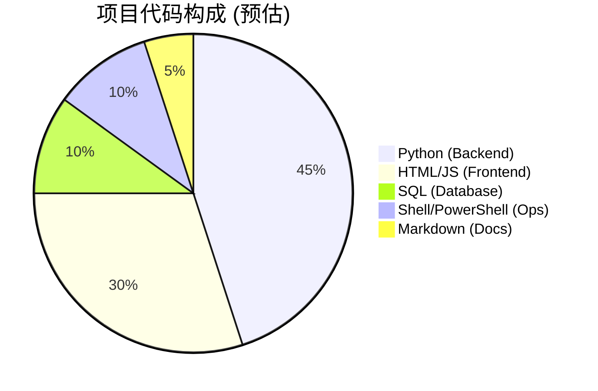
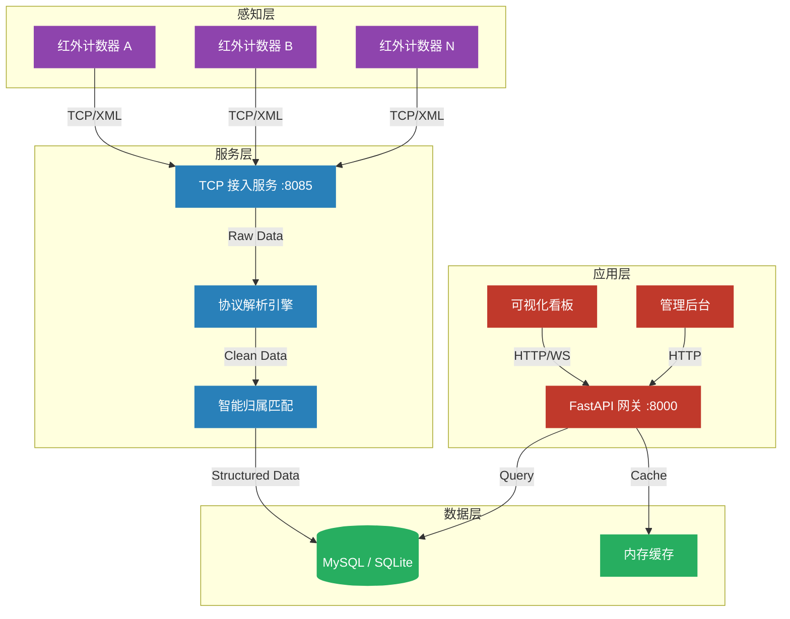
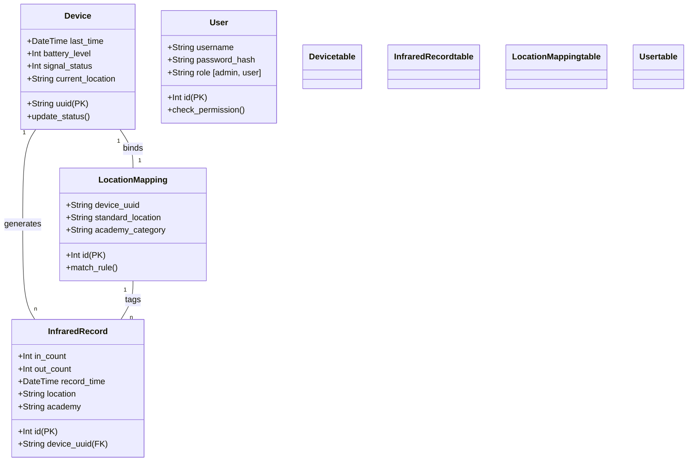
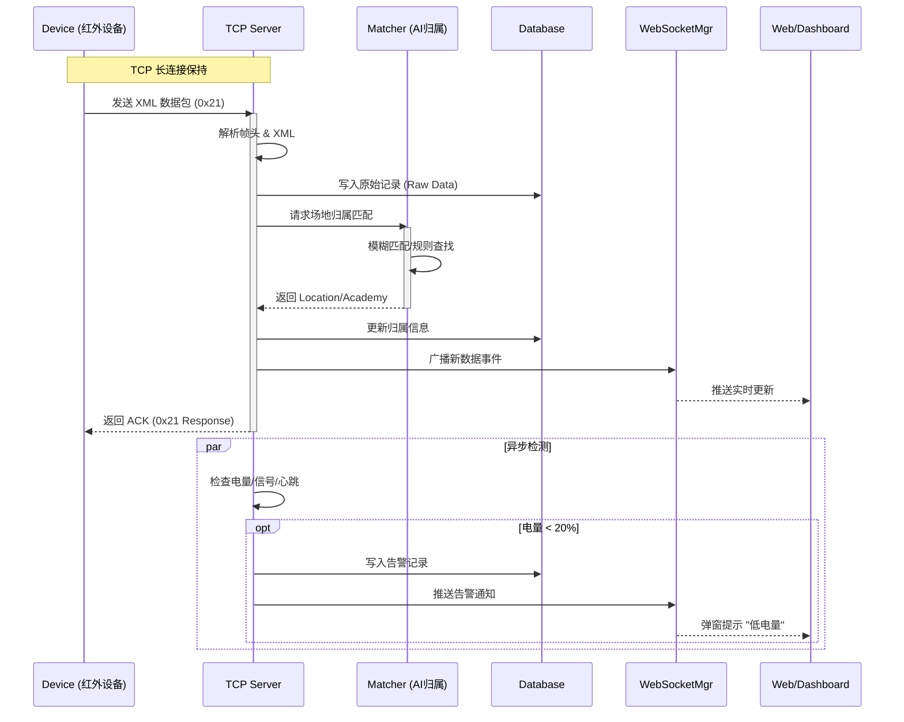
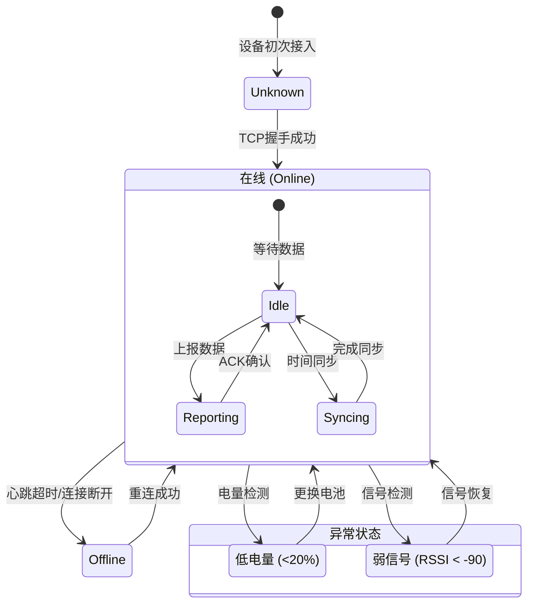

# 书院人流计数器后端 (InfraCount Backend)

> **基于 Python Asyncio + FastAPI 的高性能红外设备接入与数据分析平台**

本项目专为高校书院/场馆场景设计，提供从设备接入、数据清洗、持久化存储到实时可视化的一站式解决方案。支持高并发 TCP 连接、多租户权限管理、AI 辅助场地归属匹配以及多维度流量统计分析。

## 核心特性
- **高并发接入**：基于 `asyncio` 的 TCP 服务，单机轻松支撑数千台设备长连接。
- **稳定可靠**：内置心跳保活、断线重连、异常熔断机制，确保数据不丢失。
- **智能归属**：集成模糊匹配算法，自动关联设备与物理场地，减少人工配置。
- **实时看板**：集成 ECharts/Chart.js，提供秒级刷新的流量趋势图与热力分布。
- **安全可控**：完善的 RBAC 权限体系，支持多级管理员与操作审计。

## 快速开始 (Quick Start)

### 方式一：脚本一键部署 (推荐)
无需手动安装依赖，脚本自动检测环境并启动服务。

**Windows (PowerShell):**
```powershell
# 安装并启动
.\install.ps1
.\start.ps1
```

**Linux / macOS:**
```bash
# 赋予权限并启动
chmod +x install.sh start.sh
./install.sh
./start.sh
```

### 方式二：手动部署
1. **环境准备**：确保 Python 3.10+ 及 pip 已安装。
2. **安装依赖**：
   ```bash
   pip install -r requirements.txt -i https://pypi.tuna.tsinghua.edu.cn/simple
   ```
3. **数据库初始化**：
   - **SQLite (默认)**：直接启动，系统自动创建 `data/infrared.db`。
   - **MySQL**：需导入 `schema.sql` 并配置环境变量。
4. **启动服务**：
   ```bash
   # 终端 1：启动 TCP 接入服务 (默认端口 8085)
   python tcp_server.py
   
   # 终端 2：启动 Web API 服务 (默认端口 8000)
   uvicorn api.main:app --host 0.0.0.0 --port 8000 --reload
   ```

访问管理面板：[http://localhost:8000/dashboard](http://localhost:8000/dashboard) (默认账号：admin / admin123)

## 目录结构
```text
InfraCount/
├── api/
│   └── main.py          # FastAPI 路由入口与 Web 页面控制器
├── app/
│   ├── config.py        # 全局配置加载
│   ├── db.py            # 数据库连接池 (MySQL/SQLite)
│   ├── protocol.py      # 私有协议解析与封包构建
│   ├── matcher.py       # 场地归属智能匹配逻辑
│   ├── security.py      # 密码哈希与 Token 校验
│   └── events.py        # 全局事件总线
├── templates/           # Jinja2 前端模板 (Dashboard, Login, Devices...)
├── static/              # 静态资源 (CSS, JS, Fonts, Libs)
├── tools/
│   └── simulator.py     # 设备上报模拟器 (测试用)
├── tcp_server.py        # TCP 接入层主程序
├── requirements.txt     # Python 依赖清单
├── schema.sql           # MySQL 数据库结构定义
├── install.ps1/sh       # 一键安装脚本
└── start.ps1/sh         # 一键启动脚本
```

## 设备接入与协议
- **TCP 监听端口**：`8085` (可通过 `TCP_PORT` 环境变量修改)
- **协议格式**：`HEAD(3) + SEQ(2) + TYPE(1) + LEN(2) + PAYLOAD(XML) + TAIL(3)`
- **主要指令**：
  - `0x21` **数据上报**：设备上传进出人数 → 服务器回复 ACK。
  - `0x22` **时间同步**：设备请求校时 → 服务器下发当前时间。
  - `0x23` **心跳包**：维持 TCP 连接活跃 (默认 60s)。

## API 接口概览
| 模块 | 方法 | 路径 | 说明 |
| :--- | :--- | :--- | :--- |
| **基础** | `GET` | `/api/v1/health` | 服务健康检查 |
| **数据** | `GET` | `/api/v1/data/latest` | 获取指定设备的最新上报 |
| **数据** | `GET` | `/api/v1/data/history` | 查询历史流量记录 (支持分页) |
| **统计** | `GET` | `/api/v1/stats/daily` | 获取日流量统计趋势 |
| **统计** | `GET` | `/api/v1/stats/top` | 获取流量 Top N 设备榜单 |
| **设备** | `GET` | `/api/v1/devices` | 获取设备列表与在线状态 |
| **导出** | `GET` | `/api/v1/export/*` | 导出 CSV 格式报表 |

## 可视化功能
- **综合看板**：`GET /dashboard` - 实时流量卡片、小时级趋势图、设备状态概览。
- **设备管理**：`GET /devices` - 设备列表、在线状态监控、场地绑定编辑。
- **历史查询**：`GET /history` - 原始数据明细查询与导出。
- **账户中心**：`GET /account` - 修改密码、管理子账号 (Admin only)。

## 常见问题 (FAQ)
- **Q: 数据库连接失败？**
  - A: 请检查 `config.py` 或环境变量。如使用 SQLite，确保 `data/` 目录有写入权限。
- **Q: 页面图表不显示？**
  - A: 项目内置了常用图表库的本地资源。如遇显示问题，请检查浏览器控制台是否有静态资源加载错误。
- **Q: 如何修改监听端口？**
  - A: 修改 `app/config.py` 文件或设置环境变量 `TCP_PORT=9000`。


---

## 项目进度与规划

### 项目发展历程 (History)


### 开发路线图 (Roadmap)


### 功能完成度
| 模块 | 功能点 | 状态 | 进度 | 说明 |
| :--- | :--- | :---: | :--- | :--- |
| **接入层** | TCP 高并发服务 | 完成 |  | 基于 asyncio |
| **接入层** | 私有协议解析 | 完成 |  | XML/二进制混合 |
| **数据层** | 多数据库支持 | 完成 |  | SQLite + MySQL |
| **Web层** | 实时数据看板 | 完成 |  | 10s 自动刷新 |
| **Web层** | 账户权限管理 | 迭代 |  | 角色分级/编辑 |
| **Web层** | 标准场地配置 | 迭代 |  | 一键校正/反馈 |
| **运维层** | 一键部署脚本 | 完成 |  | Win/Linux 双端 |
| **智能层** | AI 场地校正 | 开发 |  | 模糊匹配/自学习 |
| **智能层** | 流量预测分析 | 规划 |  | 引入机器学习 |
| **生态层** | 消息推送集成 | 规划 |  | Webhook/钉钉 |

> *注：进度条实时渲染，状态图表自动更新*

### 未来规划详情 (Future Plans)
为了进一步提升系统的智能化与实用性，我们制定了详细的 2024-2025 演进计划：

#### 1. AI 增强 (AI Intelligence)
- **LSTM 客流预测模型**：
  - 基于历史流量数据与节假日/天气因子，构建 LSTM 深度学习模型。
  - 实现未来 24 小时至 7 天的客流趋势预测，辅助场馆运营调度。
- **异常行为检测**：
  - 识别非正常的流量突增/骤降（如火警逃生、设备遮挡）。
  - 结合设备信号强度与电池数据，通过规则引擎+统计学模型自动告警。

#### 2. 移动端生态 (Mobile)
- **微信小程序 (Lite)**：提供核心数据概览、实时告警推送，方便运维人员随时查看。
- **原生 App (Pro)**：集成蓝牙配置功能，支持现场对红外计数器进行参数设置与固件升级。

#### 3. 企业级集成 (Integration)
- **IM 消息推送**：
  - 支持钉钉/飞书/企业微信的 Webhook 机器人，实时推送设备离线、低电量及流量阈值告警。
- **OpenAPI V2.0**：
  - 开放更加标准化的 RESTful 接口，支持 OAuth2.0 认证，方便第三方系统（如教务系统、楼宇自控系统）集成数据。

### 战略规划脑图 (Strategic Map)


### 技术栈构成


---

## 系统架构

本系统采用经典的分层架构设计，实现了从底层硬件接入到上层应用展示的全链路打通：

- **感知层 (IoT Layer)**：负责红外计数器设备的物理连接与数据采集，通过 XML 协议打包上报。
- **服务层 (Service Layer)**：基于 asyncio 的高并发 TCP 服务，负责协议解析、心跳保活及 AI 归属匹配。
- **数据层 (Data Layer)**：采用 MySQL/SQLite 混合存储，支持原始日志与聚合统计分离，Redis/Memory 提供高速缓存。
- **应用层 (App Layer)**：FastAPI 构建的 RESTful 网关，服务于 Web Dashboard 与管理后台，并为第三方提供 API 能力。



---

## 核心数据模型

系统基于关系型数据库设计，主要包含以下核心实体：
- **Device**：设备基础信息表，记录 UUID、电量、信号及当前状态。
- **InfraredRecord**：流水日志表，存储每一次进出计数事件及其关联的地理位置。
- **LocationMapping**：位置映射规则表，定义设备与物理场地的绑定关系（AI 匹配基础）。
- **User**：系统用户表，包含角色权限与认证信息。



---

## 数据与设备流程

为了清晰展示数据如何在系统中流转，以及设备的生命周期管理，我们梳理了以下核心流程：

### 1. 设备上报与告警流程 (Sequence Diagram)


### 2. 设备生命周期状态 (State Diagram)


---

## 功能树状图

```mermaid
graph TD
    %% 样式定义 - 使用默认连线颜色
    %% linkStyle default stroke:#bbb,stroke-width:1px;
    
    %% 定义节点样式：深色背景+白色文字，边框透明
    classDef root fill:#4a148c,stroke:none,color:#fff,font-size:16px;
    classDef l1 fill:#0d47a1,stroke:none,color:#fff;
    classDef l2 fill:#1b5e20,stroke:none,color:#fff;
    classDef l3 fill:#b71c1c,stroke:none,color:#fff;

    %% 根节点
    R((InfraCount)):::root

    %% 1. 后端核心
    R --> C1[后端核心]:::l1
    C1 --> C1_1(TCP服务):::l2
    C1_1 --> C1_1_1[并发连接]:::l3
    C1_1 --> C1_1_2[心跳保活]:::l3
    C1_1 --> C1_1_3[异常熔断]:::l3

    C1 --> C1_2(协议处理):::l2
    C1_2 --> C1_2_1[XML解析]:::l3
    C1_2 --> C1_2_2[数据清洗]:::l3
    C1_2 --> C1_2_3[ACK回包]:::l3

    C1 --> C1_3(数据存储):::l2
    C1_3 --> C1_3_1[连接池管理]:::l3
    C1_3 --> C1_3_2[自动迁移]:::l3

    %% 2. Web应用
    R --> C2[Web应用]:::l1
    C2 --> C2_1(可视化):::l2
    C2_1 --> C2_1_1[实时流量图]:::l3
    C2_1 --> C2_1_2[热力分布]:::l3
    C2_1 --> C2_1_3[历史回溯]:::l3

    C2 --> C2_2(API接口):::l2
    C2_2 --> C2_2_1[RESTful规范]:::l3
    C2_2 --> C2_2_2[Token认证]:::l3
    C2_2 --> C2_2_3[数据导出]:::l3

    %% 3. 管理后台
    R --> C3[管理后台]:::l1
    C3 --> C3_1(设备管理):::l2
    C3_1 --> C3_1_1[状态监控]:::l3
    C3_1 --> C3_1_2[远程配置]:::l3

    C3 --> C3_2(场地管理):::l2
    C3_2 --> C3_2_1[自动校正]:::l3
    C3_2 --> C3_2_2[手工绑定]:::l3

    C3 --> C3_3(用户管理):::l2
    C3_3 --> C3_3_1[权限分配]:::l3
    C3_3 --> C3_3_2[操作审计]:::l3

    %% 4. 运维支持
    R --> C4[运维支持]:::l1
    C4 --> C4_1(一键脚本):::l2
    C4_1 --> C4_1_1[Windows]:::l3
    C4_1 --> C4_1_2[Linux]:::l3

    C4 --> C4_2(日志系统):::l2
    C4_2 --> C4_2_1[轮转归档]:::l3
    C4_2 --> C4_2_2[错误追踪]:::l3

    %% 5. 未来规划 (New)
    R --> C5[未来规划]:::l1
    C5 --> C5_1(AI增强):::l2
    C5_1 --> C5_1_1[流量预测]:::l3
    C5_1 --> C5_1_2[异常检测]:::l3
    
    C5 --> C5_2(移动端):::l2
    C5_2 --> C5_2_1[小程序]:::l3
    C5_2 --> C5_2_2[App]:::l3
    
    C5 --> C5_3(集成):::l2
    C5_3 --> C5_3_1[钉钉/飞书]:::l3
    C5_3 --> C5_3_2[Webhook]:::l3
```


