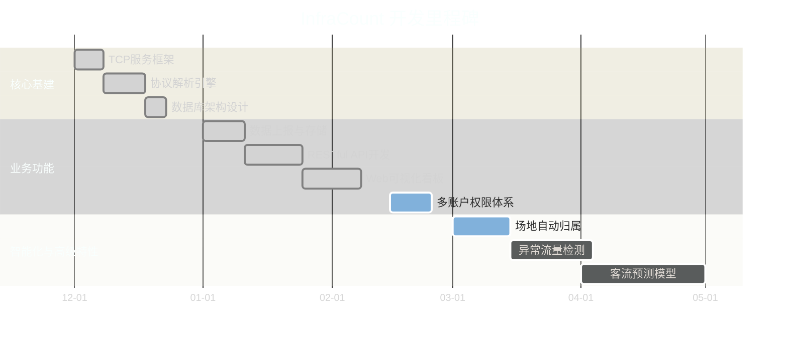
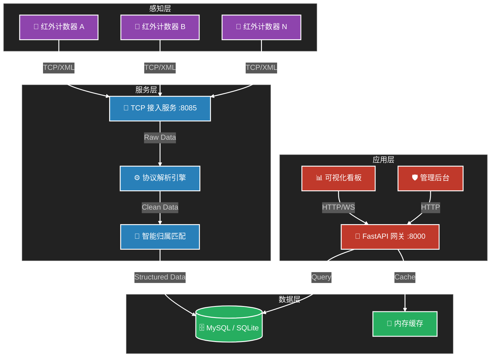

# 书院人流计数器后端

基于 Python 异步 TCP 服务与 FastAPI 构建的人流计数设备后端，支持设备数据接入、协议解析、MySQL 入库、统计聚合与可视化展示，同时提供数据导出能力。

## 快速开始
- 环境要求：`Python 3.10+`、`pip`；数据库可选：`SQLite(本地文件)` 或 `MySQL`
- 安装依赖：
  - `pip install -r requirements.txt`
  - 如网络受限可使用国内源：`pip install -r requirements.txt -i https://pypi.tuna.tsinghua.edu.cn/simple`
- 初始化数据库：
  - 使用SQLite（默认）：无需手工建库，首次启动自动在 `data/infrared.db` 创建
  - 使用MySQL：在 MySQL 执行 `schema.sql`
- 配置环境变量（可选）：
  - `DB_DRIVER`：`sqlite` 或 `mysql`（默认 `sqlite` 本地文件存储）
  - 当 `mysql`：`DB_HOST`、`DB_PORT`、`DB_USER`、`DB_PASSWORD`、`DB_NAME`
  - 当 `sqlite`：`DB_SQLITE_PATH`（默认 `./data/infrared.db`）
  - `TCP_HOST`、`TCP_PORT`（默认 `0.0.0.0:8085`）
- 启动服务：
  - TCP接入：`python tcp_server.py`
  - API服务：`uvicorn api.main:app --host 0.0.0.0 --port 8000`
- 打开页面：`http://localhost:8000/dashboard`

## 目录结构
```
app/
  config.py        # 环境与端口配置
  db.py            # aiomysql 连接池与入库
  protocol.py      # 帧解析与XML解析、回包构建
  logging.py       # 基础日志配置
api/
  main.py          # FastAPI 接口与可视化页面
tcp_server.py      # asyncio TCP 服务入口
schema.sql         # MySQL 初始化脚本
tools/
  simulator.py     # 设备上报模拟器
requirements.txt   # 依赖清单
API接入文档.md      # 详细接口与协议说明
README.md          # 项目说明（当前文件）
```

## 设备接入与协议
- 设备 TCP 端口：`8085`
- 帧结构：`HEAD(FA F5 F6) + SEQ(2) + TYPE(1) + LEN(2,BE) + XML + TAIL(FA F6 F5)`
- 支持类型：
  - `0x21` 数据上报 → 回包：`<UP_SENSOR_DATA_RES><uuid>{uuid}</uuid><ret>0</ret></UP_SENSOR_DATA_RES>`
  - `0x22` 时间同步 → 回包：`<TIME_SYNC_RES><ret>0</ret><time>YYYY-MM-DD HH:MM:SS</time></TIME_SYNC_RES>`

## API概览
- 健康检查：`GET /api/v1/health`
- 最新数据：`GET /api/v1/data/latest?uuid=...`
- 历史数据：`GET /api/v1/data/history?uuid=...&start=YYYY-MM-DD HH:MM:SS&end=YYYY-MM-DD HH:MM:SS&limit=500`
- 设备列表：`GET /api/v1/devices?limit=200`
- 日统计：`GET /api/v1/stats/daily?uuid=...&start=...&end=...`
- 小时统计：`GET /api/v1/stats/hourly?uuid=...&date=YYYY-MM-DD`
- 概览统计：`GET /api/v1/stats/summary?uuid=...`
- 设备Top榜：`GET /api/v1/stats/top?metric=in|out&start=...&end=...&limit=10`

## 可视化与导出
- 页面：`GET /dashboard`
  - 设备选择、日期范围、自动刷新（10s）
  - 日折线图与小时柱状图、统计卡片（IN/OUT/净流量/最近上报）
  - 最近记录表（默认 50 条）
- 导出CSV：
  - 日统计：`GET /api/v1/export/daily?uuid=...&start=...&end=...`
  - 小时统计：`GET /api/v1/export/hourly?uuid=...&date=YYYY-MM-DD`
  - 历史记录：`GET /api/v1/export/history?uuid=...&start=...&end=...&limit=10000`

## 模拟器
- 发送一条上报并打印 ACK：`python tools/simulator.py`

## 常见问题
- `aiomysql` 未安装或网络受限：使用国内源或离线安装 wheel 包
- 数据库不可达：接口将返回空数据以保证服务可用，恢复连接后自动入库与统计
- CDN受限：`/dashboard` 使用 Chart.js CDN，如内网环境需改为本地静态资源


---

## 📊 项目进度与规划

### 📅 开发路线图 (Roadmap)


### 🚀 功能完成度
| 模块 | 功能点 | 状态 | 进度 | 说明 |
| :--- | :--- | :---: | :--- | :--- |
| **接入层** | TCP 高并发服务 | ✅ 完成 |  | 基于 asyncio |
| **接入层** | 私有协议解析 | ✅ 完成 |  | XML/二进制混合 |
| **数据层** | 多数据库支持 | ✅ 完成 |  | SQLite + MySQL |
| **Web层** | 实时数据看板 | ✅ 完成 |  | 10s 自动刷新 |
| **Web层** | 账户权限管理 | 🚀 迭代 |  | 角色分级/编辑 |
| **运维层** | 一键部署脚本 | 🚀 迭代 |  | Win/Linux 双端 |
| **智能层** | AI 场地校正 | 🚧 开发 |  | 模糊匹配算法 |
| **智能层** | 流量预测分析 | 📅 规划 |  | 引入机器学习 |

> *注：进度条实时渲染，状态图表自动更新*

---

## 🏗️ 系统架构



---

## 🌳 功能树状图

```mermaid
graph TD
    %% 样式定义 - 强制高对比度
    linkStyle default stroke:#bbb,stroke-width:1px;
    
    %% 定义节点样式：使用深色背景+白色文字，兼容暗色模式
    classDef root fill:#4a148c,stroke:#fff,stroke-width:2px,color:#fff,font-size:16px;
    classDef l1 fill:#0d47a1,stroke:#fff,stroke-width:1px,color:#fff;
    classDef l2 fill:#1b5e20,stroke:#fff,stroke-width:1px,color:#fff;
    classDef l3 fill:#b71c1c,stroke:#fff,stroke-width:1px,color:#fff;

    %% 根节点
    R((InfraCount)):::root

    %% 1. 后端核心
    R --> C1[后端核心]:::l1
    C1 --> C1_1(TCP服务):::l2
    C1_1 --> C1_1_1[并发连接]:::l3
    C1_1 --> C1_1_2[心跳保活]:::l3
    C1_1 --> C1_1_3[异常熔断]:::l3

    C1 --> C1_2(协议处理):::l2
    C1_2 --> C1_2_1[XML解析]:::l3
    C1_2 --> C1_2_2[数据清洗]:::l3
    C1_2 --> C1_2_3[ACK回包]:::l3

    C1 --> C1_3(数据存储):::l2
    C1_3 --> C1_3_1[连接池管理]:::l3
    C1_3 --> C1_3_2[自动迁移]:::l3

    %% 2. Web应用
    R --> C2[Web应用]:::l1
    C2 --> C2_1(可视化):::l2
    C2_1 --> C2_1_1[实时流量图]:::l3
    C2_1 --> C2_1_2[热力分布]:::l3
    C2_1 --> C2_1_3[历史回溯]:::l3

    C2 --> C2_2(API接口):::l2
    C2_2 --> C2_2_1[RESTful规范]:::l3
    C2_2 --> C2_2_2[Token认证]:::l3
    C2_2 --> C2_2_3[数据导出]:::l3

    %% 3. 管理后台
    R --> C3[管理后台]:::l1
    C3 --> C3_1(设备管理):::l2
    C3_1 --> C3_1_1[状态监控]:::l3
    C3_1 --> C3_1_2[远程配置]:::l3

    C3 --> C3_2(场地管理):::l2
    C3_2 --> C3_2_1[自动校正]:::l3
    C3_2 --> C3_2_2[手工绑定]:::l3

    C3 --> C3_3(用户管理):::l2
    C3_3 --> C3_3_1[权限分配]:::l3
    C3_3 --> C3_3_2[操作审计]:::l3

    %% 4. 运维支持
    R --> C4[运维支持]:::l1
    C4 --> C4_1(一键脚本):::l2
    C4_1 --> C4_1_1[Windows]:::l3
    C4_1 --> C4_1_2[Linux]:::l3

    C4 --> C4_2(日志系统):::l2
    C4_2 --> C4_2_1[轮转归档]:::l3
    C4_2 --> C4_2_2[错误追踪]:::l3
```


